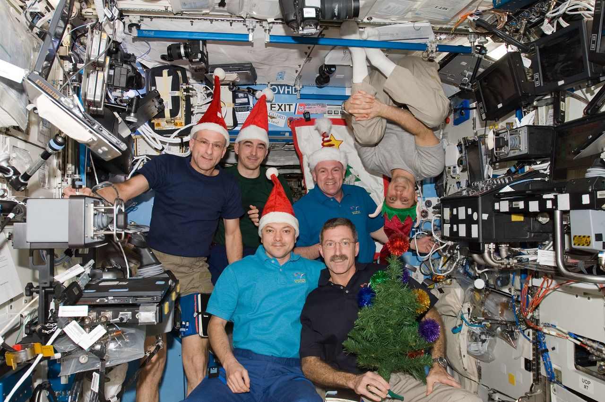

<section data-state=header0>

    <!--  -->
    CRITICAL FABLES
</section>

<section data-background-color="#0056FF" data-state=header1>
    
    <!-- <blockquote>
        The details are not the details, they make the product, just as details make the architecture — the gauge of the wire, the selection of the wood, the finish of the castings — the connections, the connections, the connections.
    </blockquote> -->
    DESIGNING THINGS
    <aside class="notes">
        Design does not exist in isolation, it isn't about a singular action. 📝
    </aside>
</section>

<section data-background-image="assets/images/tc_arm.jpg" data-state=header2>
    
    <!-- <iframe width="560" height="420" src="https://www.youtube.com/embed/0fKBhvDjuy0?si=hW3hk7N34l9aM8RI" title="YouTube video player" frameborder="0" allow="accelerometer; autoplay; clipboard-write; encrypted-media; gyroscope; picture-in-picture; web-share" allowfullscreen></iframe> -->
</section>

<section data-state=header3>
    
    
</section>

<section data-background-image="assets/images/windCon_1.jpg" data-state=header3>
    
</section>

<section data-background-color="#000000" data-state=header4>

    <!-- 
Disciplines

    
Departments

    
Institutions

    
People & Machines

    
Industries & Consumers

    
Individuals & Environment

    
Objects & Subjects

    <aside class="notes">
        Design as a process that ties things together; makes sense of things, by creating, transforming, arranging things around. 📝
    </aside> -->
    <iframe width="560" height="420" src="https://www.youtube.com/embed/q6rZwaLcLJY?si=gPELobAPzdccVStb" title="YouTube video player" frameborder="0" allow="accelerometer; autoplay; clipboard-write; encrypted-media; gyroscope; picture-in-picture; web-share" referrerpolicy="strict-origin-when-cross-origin" allowfullscreen></iframe>
</section>

<section data-background-color="#000000" data-state=header5>

    <iframe width="560" height="420" src="https://www.youtube.com/embed/Iseb1MZLxlY?si=mnjHNrUZpkd6dwVR" title="YouTube video player" frameborder="0" allow="accelerometer; autoplay; clipboard-write; encrypted-media; gyroscope; picture-in-picture; web-share" referrerpolicy="strict-origin-when-cross-origin" allowfullscreen></iframe>
</section>

<section data-background-color="#000000" data-state=header6>

    <iframe width="560" height="420" src="https://www.youtube.com/embed/hR5U5rd4N-I?si=dpkQrNej5G6OjP9i" title="YouTube video player" frameborder="0" allow="accelerometer; autoplay; clipboard-write; encrypted-media; gyroscope; picture-in-picture; web-share" referrerpolicy="strict-origin-when-cross-origin" allowfullscreen></iframe>
</section>

<section data-background-color="#000000" data-state=header7>

    <iframe width="560" height="420" src="https://www.youtube.com/embed/kQxYQ4CPyiM?si=d28eLxcsbvEW9zAM" title="YouTube video player" frameborder="0" allow="accelerometer; autoplay; clipboard-write; encrypted-media; gyroscope; picture-in-picture; web-share" referrerpolicy="strict-origin-when-cross-origin" allowfullscreen></iframe>
</section>

<section data-background-color="#000000" data-state=header8>

    <iframe width="560" height="420" src="https://www.youtube.com/embed/0kAAhpbtT2E?si=gPELobAPzdccVStb" title="YouTube video player" frameborder="0" allow="accelerometer; autoplay; clipboard-write; encrypted-media; gyroscope; picture-in-picture; web-share" referrerpolicy="strict-origin-when-cross-origin" allowfullscreen></iframe>
</section>

<section data-background-color="#000000" data-state=header9>

    <iframe width="560" height="420" src="https://www.youtube.com/embed/NXHUm-2NJ1Q?si=LyxwW6-HSy7tDYLX" title="YouTube video player" frameborder="0" allow="accelerometer; autoplay; clipboard-write; encrypted-media; gyroscope; picture-in-picture; web-share" referrerpolicy="strict-origin-when-cross-origin" allowfullscreen></iframe>
</section>

<section data-background-color="#000000" data-state=moonwalk>

    <iframe width="560" height="420" src="https://www.youtube.com/embed/4138Lvbh4xU?si=Ud4NIj3TaRsMYBkW" title="YouTube video player" frameborder="0" allow="accelerometer; autoplay; clipboard-write; encrypted-media; gyroscope; picture-in-picture; web-share" referrerpolicy="strict-origin-when-cross-origin" allowfullscreen></iframe>
</section>

<section data-background-color="indigo" data-state=header10>

    \'\'≠.\ 
</section>

<section data-state=header10>
    OBJECTS AS NARRATIVES
</section>

<section data-background-image="assets/images/pp1.jpg" data-state=header11>
    
    PROPHECY PROGRAM
</section>

<section data-background-image="assets/images/pp2.jpg" data-state=header11>
</section>

<section data-background-image="assets/images/pp22.jpg" data-state=header11>
</section>

<section data-background-image="assets/images/pp3.jpg" data-state=header11>
</section>

<section data-background-image="assets/images/pp4.jpg" data-state=header11>
</section>

<section data-background-image="assets/images/pp5.jpg" data-state=header11>
</section>

<section data-background-image="assets/images/pp6.jpg" data-state=header11>
</section>

<section data-background-image="assets/images/sho1.jpg" data-state=header12>
    
    SHOCKING
</section>

<section data-background-image="assets/images/sho2.jpg" data-state=header12>
</section>

<section data-background-image="assets/images/sho3.jpg" data-state=header12>
</section>

<section data-background-image="assets/images/sho4.jpg" data-state=header12>
</section>

<section data-background-image="assets/images/sho5.jpg" data-state=header12>
</section>

<section data-background-image="assets/images/sho6.jpg" data-state=header12>
</section>

<section data-state=header13>
    
    
</section>

<section data-state=header14>
    
    IMAGINING OBJECTS, ARTEFACTS AND THINGS EMBODYING THE WORLD WITHIN WHICH THESE THINGS EXIST.
</section>

<section data-background-image="assets/images/AC76-0492.1.jpeg" data-background-opacity="1" data-state=kesh>
    
    
    <aside class="notes">
    </aside>
</section>

<section data-background-image="assets/images/golden-1.webp" data-background-opacity="1" data-state=gold>
    
</section>

<section data-background-color="indigo" data-state=header14>
    REVERSE ARCHEOLOGY
</section>

<section data-background-color="#000000" data-state=header15>

    <iframe width="560" height="420" src="https://www.youtube.com/embed/ZKfOcR7Qbu4?si=PY1-X-VjGGxpOJds" title="YouTube video player" frameborder="0" allow="accelerometer; autoplay; clipboard-write; encrypted-media; gyroscope; picture-in-picture; web-share" referrerpolicy="strict-origin-when-cross-origin" allowfullscreen></iframe>
</section>

<section data-background-color="#000000" data-state=header16>

    <iframe width="560" height="420" src="https://www.youtube.com/embed/Z0lArfzw59c?si=ygsn0G2ROT8yxRpn" title="YouTube video player" frameborder="0" allow="accelerometer; autoplay; clipboard-write; encrypted-media; gyroscope; picture-in-picture; web-share" referrerpolicy="strict-origin-when-cross-origin" allowfullscreen></iframe>
</section>

<section data-background-image="assets/images/monrail.jpg" data-state=header17>

</section>

<section data-background-image="assets/images/pokeys.jpg" data-state=header18>

</section>

<section data-state=header19>
    
    
</section>

<section data-background-image="assets/images/traffic.jpg" data-state=header20>

</section>

<section data-background-image="assets/images/boring.png" data-state=header21>

</section>

<section data-state=header19>
    
    
</section>

<section data-background-color="indigo" data-state=header0>
    <!--  -->
    CRITICAL FABLES
</section>

<section data-state=header0>
    <!--  -->
    A fictional narrative featuring both human and nonhuman characters to convey a moral or lesson through their actions and experiences. These narratives can range from etiquette to ethics and societal values.
</section>

<section data-state=header1>
    NEW Rituals
</section>
<section data-background-image="assets/images/AC76-0492.1.jpeg" data-state=rit>

     
</section>
<section data-background-image="assets/images/AC76-0492.1.jpeg" data-state=rit>
     
</section>
<section data-background-image="assets/images/AC76-0492.1.jpeg" data-state=rit>
     
</section>

<section data-background-color="#000000" data-background-image="assets/images/AC76-0492.1.jpeg" data-background-opacity="0.3" data-state=map1>

    
</section>