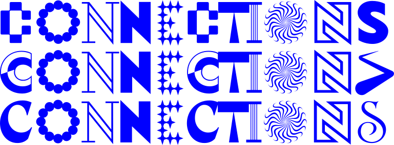
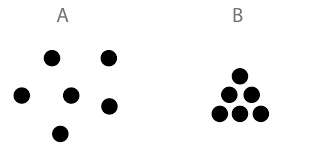

<section>
    
</section>
<section data-background-color="#0056FF" data-state=header1>
    
    <blockquote>
        The details are not the details, they make the product, just as details make the architecture — the gauge of the wire, the selection of the wood, the finish of the castings — the connections, the connections, the connections.
    </blockquote>
    <aside class="notes">
        Design does not exist in isolation, it isn't about a singular action. 📝
    </aside>
</section>
<section data-background-color="black" data-state=header2>
    
    <iframe width="560" height="420" src="https://www.youtube.com/embed/0fKBhvDjuy0?si=hW3hk7N34l9aM8RI" title="YouTube video player" frameborder="0" allow="accelerometer; autoplay; clipboard-write; encrypted-media; gyroscope; picture-in-picture; web-share" allowfullscreen></iframe>
</section>
<section data-state=header3>
    
    Connections between what?
</section>
<section data-state=header3>
<!--  -->
    
Disciplines

    
Departments

    
Institutions

    
People & Machines

    
Industries & Consumers

    
Individuals & Environment

    
Objects & Subjects

    <aside class="notes">
        Design as a process that ties things together; makes sense of things, by creating, transforming, arranging things around. 📝
    </aside>
</section>
<section data-background-color="#0056FF" data-state=header4>

    <blockquote>1. Create connections between objects, and between yourselves</blockquote>
    <aside class="notes">
        It's a collective endeavour. And it's also about getting familiar with the workshops.
    </aside>
</section>
<section data-background-color="#0056FF" data-state=header4>
    <blockquote>2. Collectively design and craft a chain reaction, a kinetic cascade, made of dynamic objects, whose sole purpose is to carry momentum forward</blockquote>
</section>
<section data-background-color="black" data-state=header5>
    
    <iframe width="560" height="420" src="https://www.youtube.com/embed/48miurCamjw?si=1tYTn--SfZ5GUSCW" title="YouTube video player" frameborder="0" allow="accelerometer; autoplay; clipboard-write; encrypted-media; gyroscope; picture-in-picture; web-share" allowfullscreen></iframe>
</section>
<section data-background-color="black" data-state=header6>
    
    <iframe width="560" height="315" src="https://www.youtube.com/embed/qybUFnY7Y8w?si=NZrWT-5aeHLvUM7B" title="YouTube video player" frameborder="0" allow="accelerometer; autoplay; clipboard-write; encrypted-media; gyroscope; picture-in-picture; web-share" allowfullscreen></iframe>
</section>
<section data-state=header7>
    
    
</section>
<section data-state=header9>
    
    

        

            01. Tear 
            02. Shove 
            03. Push 
            04. Pull 
            05. Tug 
            06. Nudge 
            07. Grasp 
            08. Jostle 
            09. Graze 
            10. Pinch 
            11. Squeeze 
            12. Fling 
            13. Toss 
            14. Throw
        

        

            15. Kick 
            16. Spin 
            17. Bump 
            18. Twirl 
            19. Flip 
            20. Tumble 
            21. Lift 
            22. Roll 
            23. Flick 
            24. Slide 
            25. Bounce 
            26. Swat 
            27. Knock 
            28. Tap
        

        

            29. Slam shut 
            30. Smash 
            31. Crush 
            32. Drop 
            33. Topple 
            34. Collapse 
            35. Swing 
            36. Flop 
            37. Punch 
            38. Collide 
            39. Hit 
            40. Ram
        

    

</section>
<section data-background-color="red">
    <h1>THE RULES</h1>
</section>
<section data-background-color="red" data-state=header8>
    
    <blockquote>1~ Keep it simple, test it, test it and test it!</blockquote>
</section>
<section data-background-color="red" data-state=header8>
    <blockquote>2~ The overall effect should be a dynamic, kinetic sculpture that represents not only you as individuals, but also as a group</blockquote>
</section>
<section data-background-color="red" data-state=header8>
    <blockquote>3~ It is your responsibility to liaise with the person before and the person after to achieve the required transition between each piece</blockquote>
</section>
<!-- <section data-background-color="red" data-state=header8>
    <blockquote>4. You will have to practice and experiment to get this right</blockquote>
</section> -->
<section data-background-color="red" data-state=header8>
    <blockquote>4~ Each object acts as a potential energy storage (e.g., via a spring, elastic band, or gravity), and should need only a slight force for release to trigger the next object.</blockquote>
</section>
<section data-background-color="red" data-state=header8>
    <blockquote>5~ Your mechanism should be robust, easily re-settable, well designed, and well made.</blockquote>
</section>
<section data-background-color="red" data-state=header8>
    <blockquote>6~ Your design may not involve petrochemicals, liquids, fire, gas or explosives. Sorry!</blockquote>
</section>
<!-- <section data-background-color="red" data-state=header8>
    <blockquote>8. The most effective sections have some kind of delay mechanism that creates a pause and creates tension. The key is to engineer the right length of delay</blockquote>
</section> -->
<section data-background-color="red" data-state=header8>
    <blockquote>7~ Use stuff found in the workshop, around the studio for their practical properties as well as the meanings that they may convey</blockquote>
</section>
<section data-background-color="red" data-state=header8>
    <blockquote>8~ Your piece should not simply be a ‘rolling ball-type’ machine, but should embody the verb of action you have chosen</blockquote>
</section>
<section data-background-color="red" data-state=header8>
    <blockquote>9~ Those at the beginning and end of the cycle should try to engineer a meaningful overture (opening) and denouement (climax)</blockquote>
</section>
<section data-background-color="red" data-state=header8>
    <blockquote>10~ Keep it simple, test it, test it and test it!</blockquote>
</section>
<section data-state=header10>
    
    <table style="font-size:1.5rem;">
        <tr>
            <th>Date</th>
            <th>Task</th>
            <th>EoD Delivery</th>
        </tr>
        <tr>
            <td>Oct. 2</td>
            <td>Brief Launch</td>
            <td>Initial Ideas Sketches</td>
        </tr>
        <tr>
            <td>Oct. 3</td>
            <td>Supervised Studio</td>
            <td>Full mapping + Transition</td>
        </tr>
        <tr>
            <td>Oct. 10</td>
            <td>Supervised Studio</td>
            <td>Iteration #1, working prototype</td>
        </tr>
        <tr>
            <td>Oct. 17</td>
            <td>Supervised Studio</td>
            <td>Iteration #2</td>
        </tr>
        <tr style="background-color: red; color: white;">
            <td>Oct. 24</td>
            <td style="font-weight: bold;">RUN THROUGH</td>
            <td>Final Iteration</td>
        </tr>
        <tr>
            <td>Oct. 25</td>
            <td>Soft Launch brief 1.2</td>
            <td style="background-color: red; color: white;">Lecture in the Bar</td>
        </tr>
    </table>
</section>
<section data-background-color="#0056FF">
    <h1>DELIVERABLES</h1>
</section>
<section data-state=header11 class="deli">

    
✓ A single mechanised chain reaction, successfully integrating all groups individual contributions.

    
✓ The completed piece should be able to fit on a FLAT surface (i.e. the studio floor, no changes in height between separate elements, unless the elements are built that way).

    
✓ The contraptions should transfer energy in the SAME DIRECTION.

    
✓ The contraptions should be easily and quickly re-settable.

    
✓ Each mechanism must have a reasonable footprint.

</section>
<section data-state=header12 data-background-color="#0056FF">

    <h1>Good Luck!!</h1>
    <blockquote style="text-align:left;">
        <a style="color:white;" href="https://sitraka-.github.io/Connections/">https://sitraka-.github.io/Connections/</a> 
        <a style="color:white;" href="https://sitraka-.github.io/Connections/KICKOFF.html">https://sitraka-.github.io/Connections/KICKOFF.html</a>
    </blockquote>
</section>